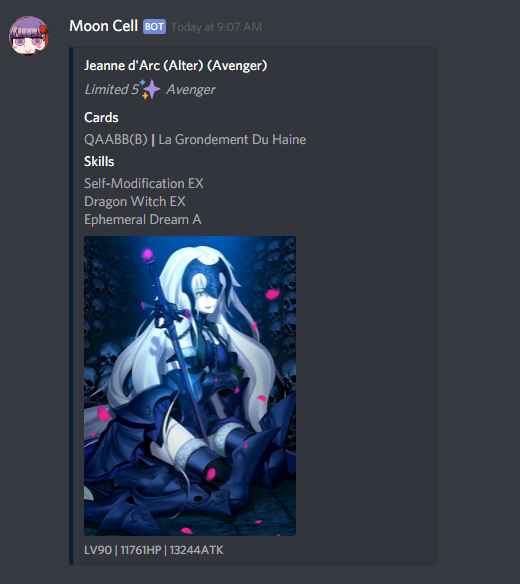

[](https://travis-ci.org/lightlyss/mooncell)
[](https://coveralls.io/github/lightlyss/mooncell?branch=master)
[](https://github.com/xojs/xo)
# Moon Cell

> Also called the Holy Grail, Eye of God, and Divine Automatic Recording Device.
> A massive collection of photonic crystals within the Moon that comprises a giant supercomputer.

## Description
A utility for basic lookup of Fate/Grand Order servants, including entry-points via
Discord bot and web interface.

## Discord Connector
Queries are accepted via any message that mentions the bot user.
Empty queries will be treated as random single summon requests, mostly following
the standard rates of Saint Quartz banners.



## Bot Setup
Set an access `TOKEN` inside a `.env` file.
```bash
npm install
npm start
```

## Web UI
Open `docs/index.html` in any modern browser.

## Tests
Black-box integration tests are provided using Jest.
```bash
npm test
```

## Patches
To update the database, make the necessary changes to `docs/json/*.db` and
add any new splash art into `docs/img/servants/`.
```bash
npm run reset-db
npm test
```
Any adjustments to functionality in `services/` should be pushed to the web UI.
```bash
npm run build
npm test
```
All these operations are idempotent.
